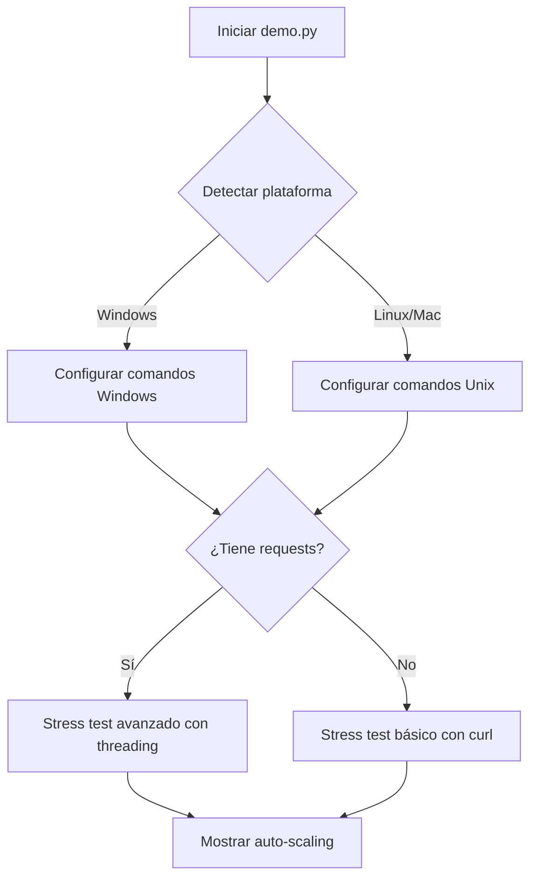

# 🌍 Notas Multiplataforma para Estudiantes

## 📋 Resumen Ejecutivo

El `demo.py` ahora funciona **automáticamente** en Windows, Linux y Mac. Como estudiante, **no necesitas hacer nada especial** - el script detecta tu plataforma y se adapta.

## 🔍 ¿Qué hace el script automáticamente?

### **Windows (detectado automáticamente)**
- ✅ **Encoding**: Usa UTF-8 para evitar errores de emojis/caracteres especiales
- ✅ **Comandos**: Reemplaza comandos Unix con equivalentes Windows:
  - `grep` → `findstr` 
  - `wc -l` → `find /c /v ""`
  - `curl` → `Invoke-WebRequest` (cuando es necesario)
- ✅ **Fallback**: Si faltan dependencias Python, usa curl nativo

### **Linux/Mac (detectado automáticamente)**  
- ✅ **Comandos nativos**: Usa `grep`, `wc`, `curl` directamente
- ✅ **Paths**: Maneja rutas Unix/POSIX correctamente

## 🎯 Para Instructores: ¿Qué cambió?

### **Antes (problemático)**
```python
# ❌ Causaba errores en Windows
result = subprocess.run("docker images | grep projects", shell=True)
```

### **Después (multiplataforma)**
```python
# ✅ Funciona en todas las plataformas
result = subprocess.run("docker images projects*", shell=True, encoding='utf-8', errors='ignore')
```

## 🛠️ Detalles Técnicos

### **1. Detección de Plataforma**
```python
import platform
is_windows = platform.system() == "Windows"
```

### **2. Comandos Adaptativos**
```python
if is_windows:
    cmd = "kubectl get pods --no-headers | find /c /v \"\""  # Windows
else:
    cmd = "kubectl get pods --no-headers | wc -l"           # Unix/Linux
```

### **3. Stress Test Inteligente**
```python
# Intenta usar requests (avanzado)
try:
    import requests
    # Stress test con threading y requests
except ImportError:
    # Fallback a curl multiplataforma
    send_heavy_task_simple()
```

## 📝 Para Estudiantes: ¿Qué esperan?

### **Output típico en Windows:**
```
KUBERNETES AUTO-SCALING DEMO
================================
Plataforma detectada: Windows 10
Este demo funciona en Windows, Linux y Mac

⚠️ Missing Python dependency: No module named 'requests'
Para stress test completo, instala: pip install requests
🖼️ Enviando tareas pesadas de procesamiento (método básico con curl)...
✅ Heavy task sent via curl
```

### **Output típico en Linux/Mac:**
```
KUBERNETES AUTO-SCALING DEMO
================================
Plataforma detectada: Linux 5.4.0
Este demo funciona en Windows, Linux y Mac

🖼️ Enviando 10 tareas pesadas de procesamiento (método avanzado)...
✅ Heavy task queued: a1b2c3d4
```

## 🚨 Errores que YA NO deberían ocurrir

- ❌ `'grep' is not recognized` (Windows)
- ❌ `UnicodeEncodeError: 'charmap' codec` (Windows)
- ❌ `curl: Connection terminated` (PowerShell)
- ❌ `wc: command not found` (Windows)

## 🎯 Como Instructor: Testing

Para probar que funciona en diferentes plataformas:

```bash
# 1. Simular Windows (cambiar detección)
# Editar demo.py temporalmente: is_windows = True

# 2. Probar sin requests
pip uninstall requests
python demo.py

# 3. Probar con requests
pip install requests  
python demo.py
```

## 💡 Filosofía del Diseño

**Principio**: "Write once, run everywhere" para Kubernetes demos.

1. **Auto-detección**: El estudiante no necesita saber en qué plataforma está
2. **Fallbacks inteligentes**: Si algo falla, hay un plan B
3. **Mensajes claros**: Si algo no está disponible, explicamos cómo instalarlo
4. **Funcionalidad core siempre funciona**: El auto-scaling SIEMPRE se demuestra

## 🔄 Flujo de Decisiones del Script



**🎯 Resultado**: Independientemente del camino, el estudiante siempre ve el auto-scaling funcionando.